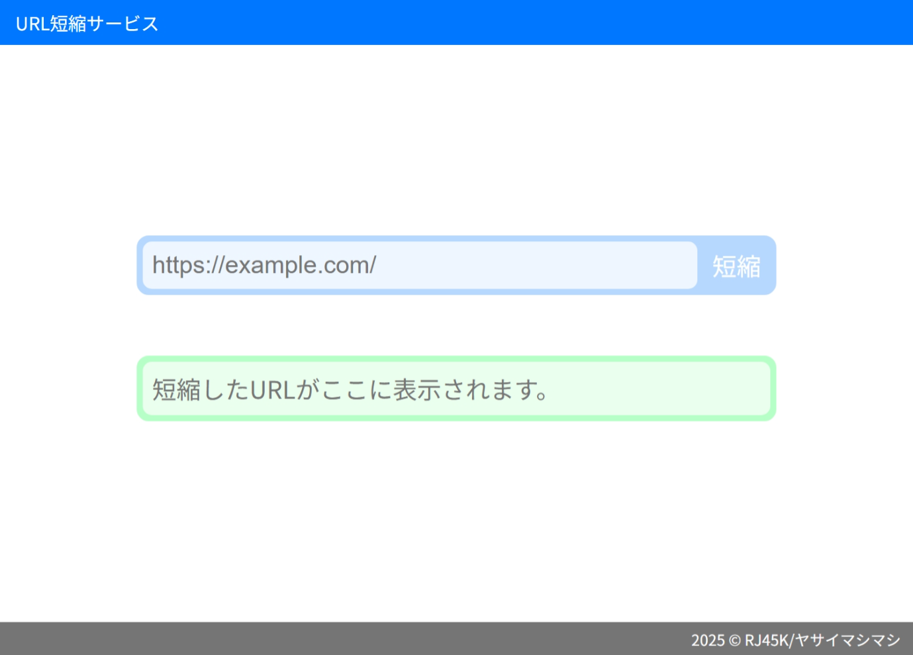

# URL短縮サービス by RJ45K
恐らく世界初！　どんなURLも単一のURLに短縮します！
 
 
<a href="https://rj45k.github.io/u/">
https://rj45k.github.io/u/
 
 

</a>
 
 
（半分ネタサイトです。 <b>実用には適しません。</b>）
 
 
 
## これは何？
どんなURLも、https://rj45k.github.io/u?r=l というURLに短縮するサイトです。（ただし、文字数制限あり。後述）
 
試しに上のURLにアクセスしてみてください。googleに飛ぶと思います。
 
今度は https://rj45k.github.io/u?r=‌‌​‌​​​‍‌‌‌​‌​​‍‌‌‌​‌​​‍‌‌‌​​​​‍‌‌‌​​‌‌‍‌‌‌​‌​‍‌​‌‌‌‌‍‌​‌‌‌‌‍‌‌‌​‌‌‌‍‌‌‌​‌‌‌‍‌‌‌​‌‌‌‍‌​‌‌‌​‍‌‌‌‌​​‌‍‌‌​​​​‌‍‌‌​‌​​​‍‌‌​‌‌‌‌‍‌‌​‌‌‌‌‍‌​‌‌‌​‍‌‌​​​‌‌‍‌‌​‌‌‌‌‍‌​‌‌‌​‍‌‌​‌​‌​‍‌‌‌​​​​‍‌​‌‌‌‌‍l ←こちらにアクセスしてみてください。yahoo japanに飛びます。
 
 

## 仕組み
ゼロ幅文字と呼ばれる見えない文字を使用し、短縮するURLを1文字ごとにエンコードして=とlの間に入れています。
 
例えば、先ほどの https://rj45k.github.io/u?r=l （googleに飛ぶやつ）だと、大体200文字のゼロ幅文字が含まれています。
 
そのため、見た目上は短縮になっていても、データ量はむしろ圧倒的に増えるので、QRコードにしたりなど実用的な使用には適しません。
 
また、文字数が短縮元の数十倍～数百倍になる関係上、長すぎるURLを短縮した場合リダイレクトが上手くいかないことがあります。（文字数の上限はブラウザによって異なります）
